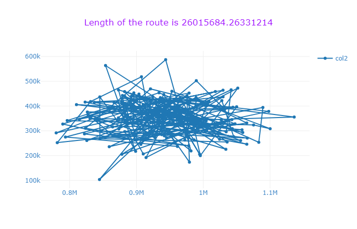
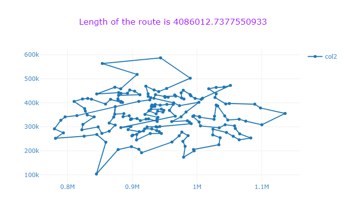

## Travelling Salesman Problem using 3OPT and 2OPT Perturbation 

A Simple Python based Travelling sales man problem which makes use of 3OPT move and 2OPT perturbation phase. The objective of the problem is to find the minimum distance to visit each city exactly once and then return to home city. Its a combinatorial optimization **(NP hard)** problem

The code makes use of heuristics search rather than exact search, so it is not guranteed that the calculated tour will be the best tour. The advantage of using heuristic search is shorter running time which makes it suitable for problems with large instances.

### Algorithm
The iterative local search comprises 2 phases. First, in a local search phase, the algorithm improves the current solution until reaching a local minimum. Second, in the perturbation phase, the algorithm perturbs the current incumbent solution (s*) in order to escape from difficult regions of the search (e.g., a
local minimum). Finally, the acceptance criterion decides whether to update s* or not.

1. S0 = **Initial Solution**
2. S* = **Local Search (S0)**
3. **while some condition**
4. &nbsp; &nbsp; &nbsp; S' = **Perturbation(S*)**
5. &nbsp; &nbsp; &nbsp; S'* = **Local Search(S')**
6. &nbsp; &nbsp; &nbsp; S* = **Acceptance criterion(S\*, S'\*)**
7. **Until no stopping criteria**

### Local search Algorithm
For the above **Local Search** Algorithm, 3 OPT move is applied but in modified way. 
1. A random edge is selected as the first edge.
2. A 3OPT move is performed with the above edge and every possible combination of other 2 edges. (This is done inorder to spped up the process).
3. For each iteration in the local search, only the best one is retained.

### Perturbation Phase
Perturbation phase is simply 2OPT swap to escape local minima. This step is repeated 5 times to have some randomness.

### Local Search after Perturbation
Local search is again called after perturbation phase, with the route generated after perturbation phase.

### Acceptance Criterion
This step decides which solution to retain. A random 5% probability is added to select the solution generated from the above step blindly otherwise, only the best is retained.

### Code Usage
The code is written in a class and is as per the above algorithm. The main class of **tsp.py** uses MultiProcessing Process to spawn 5 different process to run the code 5 times at a time. You can make it 1 if you want to run it only once. 

Logging is enabled and it continuously writes it to a log file. Check **run** method. Plotly is used to plot initial and final graph. 

There are 2 ways of generating initial solution.
1. Random Solution  (init_solution)
2. Nearest neighbour solution  (generate_nearest_neighbour_solution)

> Eucliden distance is used to calculate the tour cost. (This can be optimizd as the cost is calculated after every 2opt / 3opt move. Any Suggestions ??)

The stopping criterion of this algorith is 300 seconds (However, it takes around 20 minutes to run the code), and is not hard enforced which means if the code execution has already started and has surpassed the given seconds, then it won't be terminated but however, it will be the last execution. The stopping criterion seconds is defined in **main** function of **TSP** class.

> 300 seconds execution time is quite less and it hugely depends on the complexity (number of data points) of the file / problem. 

### Results

Running the code once, for inst-0.tsp, this is the initial random solution generated.

And after running the code, this is the final solution generated.

As you can see from the graph above, the route is optimized, but we can clearly see that there is some more room for improvement. It may be because my stopping criterion was 300 seconds, so it might need some more time to improve the solution further.

### Requirements
- Python 3
- Plotly

> You can install the dependencies using the following code: (This assumes you have Python 3.6 installed on your machine)
    `pip install -r requirements.txt`

### Running the code
Just run tsp.py. 
> `python tsp.py`

Feel free to change number of parallel runs if you don't want your computer to be stuck with 100% Process usage.

### Testing Environment
This code is tested on Dell Alienware 17 R4 Machine for which the config is as follows:
    - Windows 10 Pro (with latest patches and updates)
    - Intel 7700Hq Processor
    - 24 Gb DDR4 2400Mhz RAM (Memory)
    - W.D Black 512G.B M.2 NVME SSD DRIVE
    - JetBrains PYCharm Professional Edition (Latest version - 2018.3.1)

> **Note**: Make sure to initialize the project directory as a virtual environment.

## Feedback
It may not be very optimized, so if you tend to find any bug fixes, feature requests, pull requests, feedback, etc., are welcome...
If you like this project, please do give it a star.

You may use this tutorial freely at your own risk. See  [LICENSE](https://github.com/source-nerd/tsp_3opt_2opt/blob/master/LICENSE).
